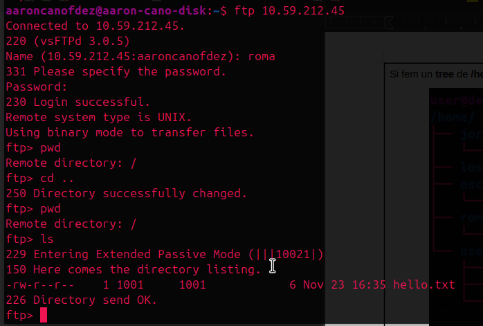
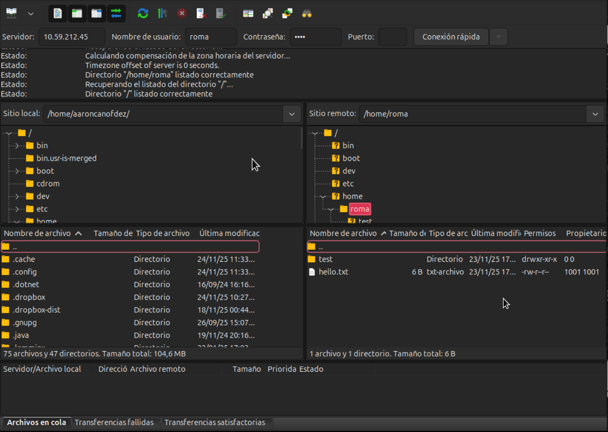

# 📘 Apuntes de FTP y VSFTPD

## 📑 Índice

1. [Introducción a FTP](#1-introducción-a-ftp)
2. [Modos de Transferencia: Activo y Pasivo](#2-modos-de-transferencia-activo-y-pasivo)
3. [Instalación y Funcionamiento de VSFTPD](#3-instalación-y-funcionamiento-de-vsftpd)
4. [Configuración General de VSFTPD](#4-configuración-general-de-vsftpd)
5. [Forzar Modo Activo o Pasivo](#5-forzar-modo-activo-o-pasivo)
6. [Usuarios Anónimos](#6-usuarios-anónimos)
7. [Enjaular (Chroot) Usuarios FTP](#7-enjaular-chroot-usuarios-ftp)
8. [Excepciones a la jaula (chroot_list)](#8-excepciones-a-la-jaula-chroot_list)
9. [Userdir + Apache + FTP](#9-userdir--apache--ftp)
10. [Conexión Gráfica con FileZilla](#10-conexión-gráfica-con-filezilla)
11. [Conexión Segura con SFTP](#11-conexión-segura-con-sftp)
12. [Enjaular Usuarios SFTP con SSH](#12-enjaular-usuarios-sftp-con-ssh)
13. [Enlaces de Interés](#13-enlaces-de-interés)

# 1. Introducción a FTP

FTP (**File Transfer Protocol**) es uno de los protocolos más antiguos para transferir ficheros entre un cliente y un servidor.

Características principales:

* **No es seguro**: el usuario y la contraseña viajan en texto plano.

* Usa **dos canales**:
  * Canal **de control** (comandos)
  * Canal **de datos** (transferencias)

* Funciona en **modo activo** o **modo pasivo**

Se usa habitualmente para:
- ✔ Servidores web
- ✔ Servidores internos
- ✔ Acceso rápido a carpetas de usuario

# 2. Modos de Transferencia: Activo y Pasivo

### 🔵 Modo Activo (PORT)

* Cliente se conecta al servidor por **21 (control)**
* El servidor abre una conexión de datos desde **el puerto 20** hacia un puerto aleatorio del cliente
* Si el cliente está detrás de un firewall → **suele fallar**

**Ejemplo**:


### 🟢 Modo Pasivo (PASV)

* Cliente se conecta al servidor por **21**
* El servidor le responde con un puerto aleatorio (>1024)
* Es el modo recomendado.

**Ejemplo**:


# 3. Instalación y Funcionamiento de VSFTPD

```bash
sudo apt install vsftpd
sudo systemctl enable --now vsftpd
sudo systemctl status vsftpd
```

**Puertos típicos:**

* **21** → Control
* **20** → Datos en modo activo
* **>1024** → Datos en modo pasivo

**Descarga y subida de archivos**:

<code>get &lt;nombre/ruta-archivo&gt;</code> --> Coge un archivo del servidor y lo descarga en el cliente.

<code>put &lt;nombre/ruta-archivo&gt;</code> --> Envia un archivo desde el cliente hasta el servidor.

**Entorno de los comandos**:

Otro aspecto a tener encuenta cuando utilizamos FTP es el entorno de los comandos, depende de como se escriban se ejecutaran en el lado del servidor o del cliente:

- <code>!ls</code> --> Esto se ejecuta en el cliente.
- <code>ls</code> --> Esto se ejecuta en el servidor.

Con el carácter <code>!</code> podemos ejecutar comandos en el cliente mientras estamos conectados por FTP.

**Excecpión**:

Esto no aplica para los comandos <code>**get**</code> y <code>**put**</code>.

# 4. Configuración General de VSFTPD

Archivo principal:

```
/etc/vsftpd.conf
```

Parámetros básicos:

```conf
listen=YES/NO
listen_ipv6=YES/NO
anonymous_enable=NO
local_enable=YES
write_enable=YES
local_umask=022
```

Después de modificar:

```bash
sudo systemctl reload vsftpd
```

# 5. Forzar Modo Activo o Pasivo

## 🔵 Forzar modo activo

```conf
pasv_enable=NO
port_enable=YES
```

## 🟢 Forzar modo pasivo (recomendado)

```conf
pasv_enable=YES
pasv_min_port=10000
pasv_max_port=10050
```

Al configurar el modo pasivo podemos limitar los puertos que se utilizan, la única condición es que todos estén por encima del puerto 1024.

# 6. Usuarios Anónimos

## Habilitar acceso anónimo

```conf
anonymous_enable=YES → Habilitem l’accés al servidor per a usuaris anònims.
write_enable=YES → Donem permisos d’escriptura, si no no deixa pujar fitxers.
anon_mkdir_write_enable=NO → No li donem permisos per crear directoris.
anon_upload_enable=YES → Li donem permisos per pujar fitxers.
```

La raíz por defecto del usuario anonymous es **<code>/srv/ftp</code>**.

Para permitir subir archivos sin comprometer la seguridad:

```bash
sudo mkdir /srv/ftp/upload
sudo chmod 777 /srv/ftp/upload
```

También puedes cambiar la home del usuario anónimo:

```conf
anon_root=/srv/ftp/public
```

**Aspecto importante**:

El propietario de la raiz del usuario anónimo por defecto es **root**, se puede cambiar con directivas pero es un agujero de seguridad, por lo tanto, si queremos que se puedan subir archivos a la raíz del usuario anónimo lo mejor es crear un directorio como hemos visto anteriormente.

# 7. Enjaular usuarios FTP

“Enjaular” significa que un usuario **no puede salir de su /home** y la ve como si fuera `/`.

```conf
chroot_local_user=YES
```

**Ejemplo**:



**Problema habitual:**

El directorio home no puede ser escribible por seguridad, así que se debe crear una subcarpeta para subir archivos.

# 8. Excepciones a la jaula (chroot_list)

Crear archivo (o editar si ya existe o ya se ha creado previamente):

```
/etc/vsftpd.chroot_list
```

Configurar:

```conf
chroot_local_user=YES
chroot_list_enable=YES
chroot_list_file=/etc/vsftpd.chroot_list
```

Los usuarios listados en este archivo **NO estarán enjaulados**.

**Ejemplo:**

```
aaron
```

Solo deben añadirse los nombres de los usuarios que no se quieren enjaular, no hayq que especificar nada más.

# 9. Userdir + Apache + FTP

Permite que cada usuario tenga su propia web:

```
/home/usuario/public_html
```

**Activar el módulo:**

```bash
sudo a2enmod userdir
sudo systemctl reload apache2
```

**Crear archivo <code>index.html</code> y subirlo**:

```html
<h1>Bienvenido a user dir</h1>
```

```bash
ftp> put index.html
```

**URL de acceso**:

```
http://host/~usuario
```

# 10. Conexión Gráfica con FileZilla

FileZilla es un cliente de FTP que nos permite manejar el protocolo con una interfaz gráfica.

Para utilizarlo tenemos que instalarlo en la máquina cliente:

```bash
sudo apt install filezilla
```

Cuando abramos FileZilla veremos los siguientes campos para conectarnos con el servidor:

- Servidor (IP del servidor a conectarnos)
- Nombre de usuario (Nombre de usuario existente en el servidor)
- Contraseña (Contraseña del usuario)
- Puerto (Puedes especificar un puerto si lo deseas, por defecto usa el 21 y para SFTP puedes utilizar el 22).

**Ejemplo de conexión con FileZilla**:



En este caso nos hemos conectado con un usuario que no está enjaulado, por eso podemos ver todo el sistema de archivos del servidor.

# 11. Conexión Segura con SFTP

```bash
sftp usuario@servidor
```

Notas importantes:

* **No usa FTP**, sino SSH.
* Todo el tráfico va cifrado.
* Si escaneamos la red con un sniffer (ej.: Wireshark) lo identifica como SSH, no como FTP.

# 12. Enjaular Usuarios SFTP con SSH

Editar `/etc/ssh/sshd_config`:

```conf
Match User nombreusuario
    ChrootDirectory /home/nombreusuario
    ForceCommand internal-sftp
    X11Forwarding no
    AllowTcpForwarding no
```

Requisitos:

* El directorio raíz debe ser propiedad de root:

```bash
sudo chown root:root /home/nombreusuario
```

* Crear carpeta interior para subir archivos:

```bash
sudo mkdir /home/nombreusuario/upload
sudo chown nombreusuario:nombreusuario /home/nombreusuario/upload
sudo chmod 755 /home/nombreusuario/upload
```

Reiniciar SSH:

```bash
sudo systemctl reload sshd
```

# 13. Enlaces de Interés

* Directivas VSFTPD
  [http://vsftpd.beasts.org/vsftpd_conf.html](http://vsftpd.beasts.org/vsftpd_conf.html)

* Administración de usuarios y grupos
  [http://www.ite.educacion.es/formacion/materiales/85/cd/linux/m1/administracin_de_usuarios_y_grupos.html](http://www.ite.educacion.es/formacion/materiales/85/cd/linux/m1/administracin_de_usuarios_y_grupos.html)

* Userdir en Apache
  [https://www.evaristogz.com/configurar-userdir-automatico-apache2/](https://www.evaristogz.com/configurar-userdir-automatico-apache2/)

---

<code>Hecho por Aarón Cano ([rxnwashere](https://github.com/rxnwashere))</code>